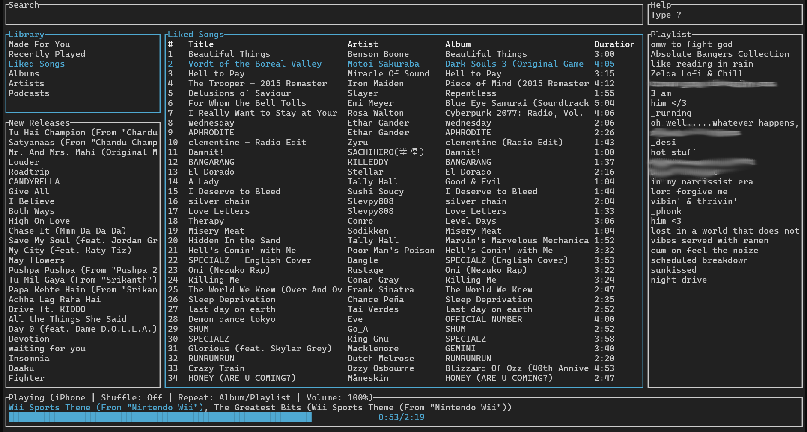
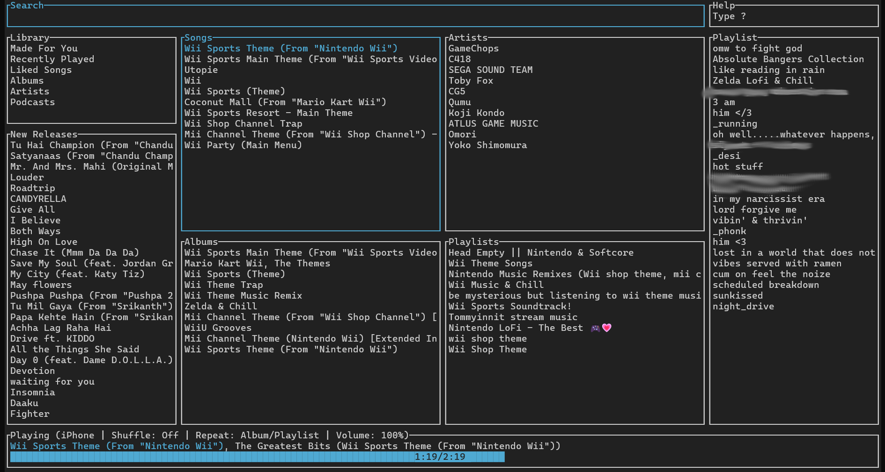
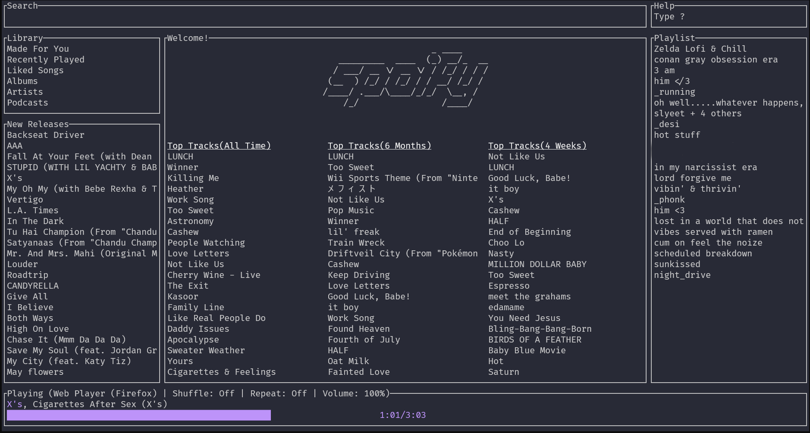
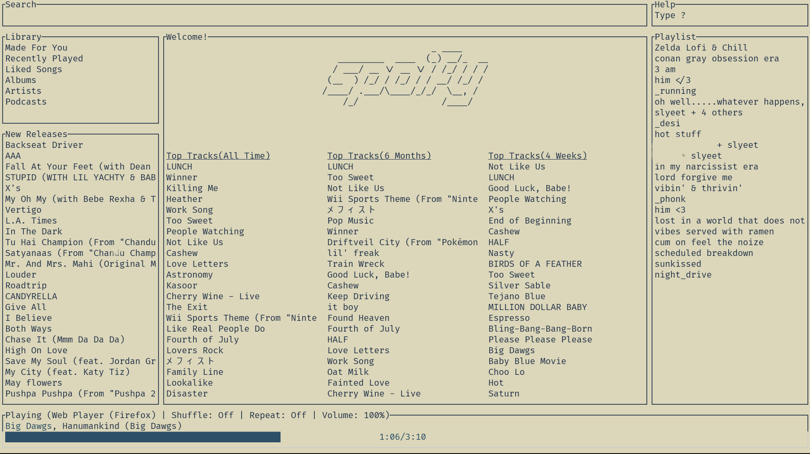
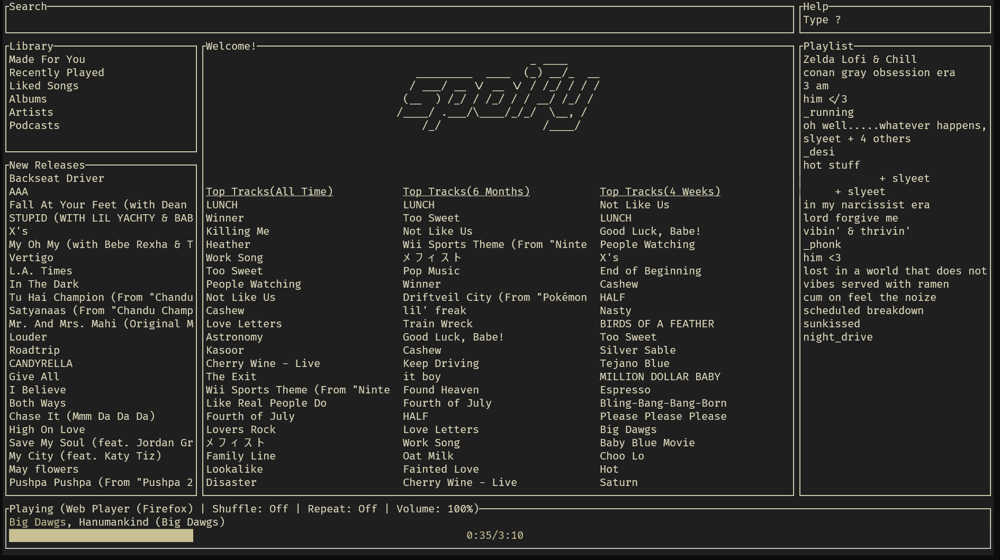

# Spoify
This is a Rust project that implements a Spotify client within your terminal. It allows you to browse and interact with Spotify directly from the command line.




- [Spoify](#spoify)
  - [Connecting to Spotify's API](#connecting-to-spotifys-api)
    - [Instructions](#instructions)
  - [Installation](#installation)
    - [Cargo](#cargo)
  - [Configuration](#configuration)
  - [Themes](#themes)
    - [Default](#default)
    - [Dracula](#dracula)
    - [Kanagawa Light](#kanagawa-light)
    - [Kanagawa Dark](#kanagawa-dark)
  - [Limitations](#limitations)
  - [Libraries used](#libraries-used) 

## Connecting to Spotify's API

In order for `spoify` to work it needs to be connected to Spotify's API.

### Instruction

1. Go to the [Spotify dashboard](https://developer.spotify.com/dashboard/applications)
2. Click `Create an app`
   - You now can see your `Client ID` and `Client Secret`
3. Now click `Edit Settings`
4. Add `http://localhost:8888/callback` to the Redirect URIs
5. Scroll down and click `Save`
6. You are now ready to authenticate with Spotify!
7. Enter you `Client ID` and `Client Secret`.
8. Run `spoify`
9. You will be redirected to an official Spotify webpage to ask you for permissions.
10. After accepting the permissions, you'll be redirected to localhost. You'll be redirected to a blank webpage that might say something like "Connection Refused" since no server is running. Regardless, copy the URL and paste into the prompt in the terminal.

There we go, now you can use `spoify`.

## Installation

### Cargo

First, install [Rust](https://www.rust-lang.org/tools/install) (using the recommended `rustup` installation method) and then

```bash
cargo install spoify
```

This method will build the binary from source.

To update, run the same command again.

## Configuration

You can go to the configure folder and change the theme, keybindings and other related settings of the application.
You can add more themes in the theme folder. Some popular themes already comes with `spoify`. More will be added time to time.

You can open the configure folder directly through the terminal. Check `help` menu in the application.
The keybind to open the configure folder is:

```
~
```

## Themes

A collection of themes that already comes with spoify

### Default


### Dracula



### Kanagawa Light



### Kanagawa Dark



## Limitations

This app uses the [Web API](https://developer.spotify.com/documentation/web-api/) from Spotify, which doesn't handle streaming itself. So you'll need an official Spotify app open in any device in order to play tracks.

If you want to play tracks or control the playback part, Spotify requires that you have a Premium account.

## Libraries used

- [rspotify](https://github.com/ramsayleung/rspotify)
- [ratatui](https://github.com/ratatui-org/ratatui)
